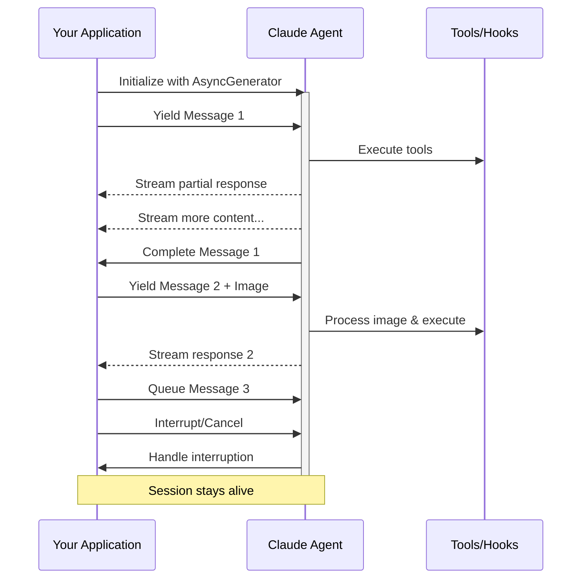

# Streaming Input

> Understanding the two input modes for Claude Code SDK and when to use each

## Overview

The Claude Code SDK supports two distinct input modes for interacting with agents:

* **Streaming Input Mode** (Default & Recommended) - A persistent, interactive session
* **Single Message Input** - One-shot queries that use session state and resuming

This guide explains the differences, benefits, and use cases for each mode to help you choose the right approach for your application.

## Streaming Input Mode (Recommended)

Streaming input mode is the **preferred** way to use the Claude Code SDK. It provides full access to the agent's capabilities and enables rich, interactive experiences.

It allows the agent to operate as a long lived process that takes in user input, handles interruptions, surfaces permission requests, and handles session management.

### How It Works



### Benefits

<CardGroup cols={2}>
  <Card title="Image Uploads" icon="image">
    Attach images directly to messages for visual analysis and understanding
  </Card>

  <Card title="Queued Messages" icon="layer-group">
    Send multiple messages that process sequentially, with ability to interrupt
  </Card>

  <Card title="Tool Integration" icon="wrench">
    Full access to all tools and custom MCP servers during the session
  </Card>

  <Card title="Hooks Support" icon="link">
    Use lifecycle hooks to customize behavior at various points
  </Card>

  <Card title="Real-time Feedback" icon="bolt">
    See responses as they're generated, not just final results
  </Card>

  <Card title="Context Persistence" icon="database">
    Maintain conversation context across multiple turns naturally
  </Card>
</CardGroup>

### Implementation Example

<CodeGroup>
  ```typescript TypeScript
  import { query } from "@anthropic-ai/claude-code";
  import { readFileSync } from "fs";

  async function* generateMessages() {
    // First message
    yield {
      type: "user" as const,
      message: {
        role: "user" as const,
        content: "Analyze this codebase for security issues"
      }
    };
    
    // Wait for conditions or user input
    await new Promise(resolve => setTimeout(resolve, 2000));
    
    // Follow-up with image
    yield {
      type: "user" as const,
      message: {
        role: "user" as const,
        content: [
          {
            type: "text",
            text: "Review this architecture diagram"
          },
          {
            type: "image",
            source: {
              type: "base64",
              media_type: "image/png",
              data: readFileSync("diagram.png", "base64")
            }
          }
        ]
      }
    };
  }

  // Process streaming responses
  for await (const message of query({
    prompt: generateMessages(),
    options: {
      maxTurns: 10,
      allowedTools: ["Read", "Grep"]
    }
  })) {
    if (message.type === "result") {
      console.log(message.result);
    }
  }
  ```

  ```python Python
  from anthropic_claude_code import query, ClaudeCodeOptions
  import asyncio

  async def streaming_analysis():
      async def message_generator():
          # First message
          yield {
              "type": "user",
              "message": {
                  "role": "user",
                  "content": "Analyze this codebase for security issues"
              }
          }
          
          # Wait for conditions
          await asyncio.sleep(2)
          
          # Follow-up message
          yield {
              "type": "user", 
              "message": {
                  "role": "user",
                  "content": "Check for authentication vulnerabilities"
              }
          }
      
      # Process streaming responses
      async for message in query(
          prompt=message_generator(),
          options=ClaudeCodeOptions(
              max_turns=10,
              allowed_tools=["Read", "Grep"]
          )
      ):
          if hasattr(message, 'result'):
              print(message.result)
  ```
</CodeGroup>

## Single Message Input

Single message input is simpler but more limited.

### When to Use Single Message Input

Use single message input when:

* You need a one-shot response
* You do not need image attachments, hooks, etc.
* You need to operate in a stateless environment, such as a lambda function

### Limitations

<Warning>
  Single message input mode does **not** support:

  * Direct image attachments in messages
  * Dynamic message queueing
  * Real-time interruption
  * Hook integration
  * Natural multi-turn conversations
</Warning>

### Implementation Example

<CodeGroup>
  ```typescript TypeScript
  import { query } from "@anthropic-ai/claude-code";

  // Simple one-shot query
  for await (const message of query({
    prompt: "Explain the authentication flow",
    options: {
      maxTurns: 1,
      allowedTools: ["Read", "Grep"]
    }
  })) {
    if (message.type === "result") {
      console.log(message.result);
    }
  }

  // Continue conversation with session management
  for await (const message of query({
    prompt: "Now explain the authorization process",
    options: {
      continue: true,
      maxTurns: 1
    }
  })) {
    if (message.type === "result") {
      console.log(message.result);
    }
  }
  ```

  ```python Python
  from anthropic_claude_code import query, ClaudeCodeOptions

  # Simple one-shot query
  async for message in query(
      prompt="Explain the authentication flow",
      options=ClaudeCodeOptions(
          max_turns=1,
          allowed_tools=["Read", "Grep"]
      )
  ):
      if hasattr(message, 'result'):
          print(message.result)

  # Continue with session management
  async for message in query(
      prompt="Now explain the authorization process",
      options=ClaudeCodeOptions(
          continue_conversation=True,
          max_turns=1
      )
  ):
      if hasattr(message, 'result'):
          print(message.result)
  ```
</CodeGroup>
