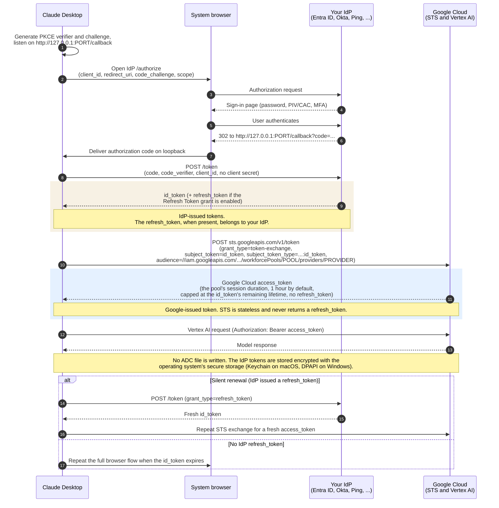
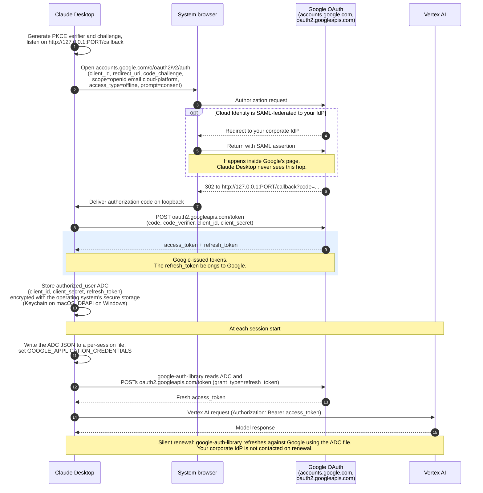

> ## Documentation Index
> Fetch the complete documentation index at: https://claude.com/docs/llms.txt
> Use this file to discover all available pages before exploring further.

# Deploy Claude Desktop on 3P with Google Cloud's Agent Platform

> Set up Google Cloud, choose an authentication path for your organization, and configure Claude Desktop on 3P to use Claude models on Google Cloud's Agent Platform

This page walks an IT administrator through a complete deployment on Google Cloud's Agent Platform (formerly Vertex AI): enabling Claude in your Google Cloud project, choosing the authentication path that fits your organization, preparing devices, and pushing the managed configuration. If you only need the list of configuration keys, skip to [Configure the app](#configure-the-app).

## Choose an authentication approach

Google Cloud's Agent Platform authenticates with Google Cloud Application Default Credentials, which can be supplied several ways. The right one depends on whether your users have Google identities and whether you need per-user attribution in Cloud Audit Logs.

| Scenario                                                                                                              | Use                                                                                                                    | Per-device prerequisite              | Per-user Cloud Audit Logs identity | Notes                                                                                                                                    |
| --------------------------------------------------------------------------------------------------------------------- | ---------------------------------------------------------------------------------------------------------------------- | ------------------------------------ | ---------------------------------- | ---------------------------------------------------------------------------------------------------------------------------------------- |
| Proof of concept, single team                                                                                         | [Service-account key](#credentials-file) (`inferenceVertexCredentialsFile`)                                            | The key file on each device          | No (shared service account)        | A long-lived secret distributed to every device. Simplest to start; not recommended for broad rollout.                                   |
| Users have Google Workspace or Cloud Identity accounts                                                                | [In-app Google sign-in](#in-app-google-sign-in) (`inferenceVertexOAuth*`)                                              | None                                 | Yes                                | Users sign in with their Google account inside the app. See the session-control warning below.                                           |
| Users authenticate with a third-party IdP (Entra ID, Okta, Ping, …) and you don't want to provision Google identities | [In-app Workforce Identity sign-in](#in-app-workforce-identity-sign-in) (`inferenceVertexWorkforce*`)                  | None                                 | Yes (workforce-pool principal)     | Users sign in with their corporate identity inside the app. The app runs PKCE against your IdP and exchanges the ID token at Google STS. |
| Your organization already has tooling that obtains a bearer token accepted by Google Cloud's Agent Platform           | [Credential helper](/docs/third-party/claude-desktop/configuration#inferencecredentialhelper) (`inferenceCredentialHelper`) | The helper executable on each device | Depends on what the helper obtains | The helper's stdout is sent as the bearer on each inference request.                                                                     |
| You already operate an LLM proxy                                                                                      | [Gateway provider](/docs/third-party/claude-desktop/gateway) instead of Google Cloud's Agent Platform                       | None                                 | At your gateway                    | The proxy holds the Google Cloud credentials; the app authenticates only to the proxy.                                                   |

<Warning>
  If your Google Workspace or Cloud Identity organization enforces a **Google Cloud session length** of a few hours or less (Admin console → Security → Google Cloud session control), the in-app Google sign-in stores a refresh token that is subject to that policy, and users will be prompted to sign in again each time it expires. For short session policies, either mark your OAuth client as a [trusted app exempt from reauthentication](https://support.google.com/a/answer/9368756), or use a service-account key, Workforce Identity sign-in, or the gateway provider instead.
</Warning>

## How the two sign-in flows compare

The [in-app Google sign-in](#in-app-google-sign-in) and [in-app Workforce Identity sign-in](#in-app-workforce-identity-sign-in) approaches both open the system browser for a one-time consent and then renew in the background (or, for Workforce Identity, re-prompt in the browser when your IdP does not issue a refresh token). They differ in which party issues the refresh token, whether Google's Security Token Service is involved, and whether an Application Default Credentials file is written. The diagrams below show each flow end to end, and the table that follows summarizes the differences.

### Workforce Identity sign-in

Claude Desktop runs authorization code with PKCE directly against **your** IdP. The IdP's ID token is then exchanged at Google's Security Token Service for a short-lived Google Cloud access token. Google STS is stateless and never issues a refresh token, so every renewal starts at your IdP.

### Google sign-in (OAuth)

Claude Desktop runs authorization code with PKCE against **Google's** OAuth endpoints. Google issues the refresh token, and the app writes it to an `authorized_user` Application Default Credentials file that the Google Cloud client library consumes. Your corporate IdP may appear inside Google's sign-in page (if Cloud Identity is federated via SAML), but the app never talks to it directly.

### Side by side

|                                            | Workforce Identity sign-in                                         | Google sign-in (OAuth)                                                       |
| ------------------------------------------ | ------------------------------------------------------------------ | ---------------------------------------------------------------------------- |
| OAuth peer the app talks to                | Your IdP's OIDC endpoints                                          | Google's OAuth 2.0 endpoints                                                 |
| Where your corporate IdP appears           | Directly (the app opens it)                                        | Inside Google's sign-in page, via Cloud Identity SAML federation (optional)  |
| Refresh token issued by                    | Your IdP (when the Refresh Token grant is enabled on the client)   | Google                                                                       |
| Google STS (`sts.googleapis.com`) involved | Yes, on every access-token renewal                                 | No                                                                           |
| ADC file written                           | No                                                                 | Yes (`authorized_user` JSON, pointed to by `GOOGLE_APPLICATION_CREDENTIALS`) |
| Registered on the Google side              | Workforce pool and OIDC provider (IAM & Admin)                     | Desktop-app OAuth 2.0 client (APIs & Services → Credentials)                 |
| Per-user prerequisite                      | An account at your IdP                                             | A Google Workspace or Cloud Identity account                                 |
| Client registered at your IdP              | Public (native) OAuth client, PKCE required, loopback redirect URI | None (your IdP is federated to Cloud Identity, not to the app)               |

## Set up Google Cloud

These steps are performed once per Google Cloud project, regardless of which authentication approach you chose. You need a project with Owner or Editor access.

<Steps>
  <Step title="Enable the Vertex AI API">
    In the [Google Cloud console](https://console.cloud.google.com/apis/library/aiplatform.googleapis.com), enable the **Vertex AI API** for your project.
  </Step>

  <Step title="Enable Claude models in Model Garden">
    In the [Model Garden](https://console.cloud.google.com/vertex-ai/model-garden), locate the Claude models you intend to deploy and click **Enable** on each. Model availability varies by region; enable them in the region you will set as `inferenceVertexRegion`.
  </Step>

  <Step title="Grant users access to Google Cloud's Agent Platform">
    Each authenticated principal needs permission to call the model. On the project's **IAM** page, grant the **Vertex AI User** role (`roles/aiplatform.user`) to:

    * the service account, if using a service-account key file
    * the Google group containing your users, if using in-app Google sign-in

    If your organization uses a narrower custom role, it must include at minimum `aiplatform.endpoints.predict`.
  </Step>

  <Step title="Create an OAuth client (in-app Google sign-in only)">
    If you chose in-app Google sign-in, create a Desktop-app OAuth client in your project. See [In-app Google sign-in](#in-app-google-sign-in) below for the full procedure, including consent-screen setup.
  </Step>

  <Step title="Federate to your IdP (optional)">
    If your users authenticate with Microsoft Entra ID, Okta, or another identity provider and do not already have Google accounts, you have two options:

    * **Workforce Identity Federation** (recommended). Create a workforce pool with an OIDC provider, and use the [in-app Workforce Identity sign-in](#in-app-workforce-identity-sign-in) approach. Users sign in directly with their corporate identity; no Google identity is provisioned.
    * **Cloud Identity with SAML SSO.** Provision a free Cloud Identity tenant and configure SAML single sign-on to your IdP. Users then sign in through the in-app Google sign-in approach with a Google identity that is backed by your IdP. See [Set up SSO with a third-party IdP](https://support.google.com/cloudidentity/answer/12032922) in the Cloud Identity documentation.
  </Step>
</Steps>

## Prepare devices

What each end-user device needs depends on the authentication approach you chose.

### Credentials file

Create a service account in your project, grant it the **Vertex AI User** role, and download its JSON key. Distribute the key file to a fixed path on each device through your device-management tooling and set `inferenceVertexCredentialsFile` to that path.

`inferenceVertexCredentialsFile` accepts any Application Default Credentials JSON format, so if your environment already produces an `authorized_user` file (from `gcloud auth application-default login`) or an `external_account` Workforce Identity Federation configuration, you can point at that file instead. For `external_account` files, the `credential_source` must be of type `file` or `url` (`executable` sources are not supported), and separate tooling on the device must obtain the IdP token and write it to the configured location; Claude Desktop does not perform that step.

### In-app Google sign-in

No per-device preparation is required. The sign-in experience uses a Google OAuth client that **you create in your own Google Cloud project**; Anthropic does not provide or operate an OAuth client for this flow. Distribute the OAuth client ID and secret in the managed configuration (see [Configure the app](#configure-the-app)).

#### How it works

When `inferenceVertexOAuthClientId` and `inferenceVertexOAuthClientSecret` are both set, the app shows a **Sign in with Google** page at first launch. Clicking the button opens the system browser for a standard Google consent flow, and the app listens on a loopback address for the redirect. On success, the app stores the user's Google refresh token encrypted with the operating system's secure storage (Keychain on macOS, DPAPI on Windows) and returns to Cowork.

At the start of each Cowork session, the app writes an `authorized_user` Application Default Credentials file (the same format produced by `gcloud auth application-default login`) into the session sandbox and points `GOOGLE_APPLICATION_CREDENTIALS` at it. The Google Cloud client library inside the sandbox handles access-token minting and refresh automatically.

If the stored refresh token is revoked or expires, the app shows a **Sign in again** prompt; clicking it reopens the Google consent flow in the browser. If you deploy a new OAuth client ID, the app clears the stored token and shows the sign-in page on next launch.

#### Create the OAuth client

<Steps>
  <Step title="Configure the OAuth consent screen">
    In the Google Cloud Console, in the project where you enabled Claude models, open **APIs & Services → OAuth consent screen**.

    If your project belongs to a Google Workspace organization, select the **Internal** user type. Internal apps are limited to users in your Workspace and do not require Google verification, regardless of which scopes they request.

    If the project is not in a Workspace organization, you must use the **External** user type. Because this flow requests the `https://www.googleapis.com/auth/cloud-platform` scope, Google classifies the app as using a sensitive scope, and publishing it beyond test users requires Google's OAuth verification process. For that reason, Internal is strongly recommended for enterprise deployments.
  </Step>

  <Step title="Create a Desktop OAuth client">
    In **APIs & Services → Credentials**, choose **Create credentials → OAuth client ID**, and select **Desktop app** as the application type.

    Record the generated **Client ID** (ending in `.apps.googleusercontent.com`) and **Client secret**. For installed applications, Google does not treat the client secret as confidential; the flow is protected by PKCE and by the loopback redirect, so it is safe to distribute the secret in a managed configuration profile.

    You do not need to add redirect URIs. Desktop-app clients permit loopback (`http://127.0.0.1:<port>`) redirects automatically.
  </Step>

  <Step title="Allow network egress">
    The sign-in flow and subsequent token refreshes reach `accounts.google.com` and `oauth2.googleapis.com` from the user's device. These hosts are already included in the standard egress requirements for Google Cloud's Agent Platform, so if you allowed egress based on the **Egress** section of the configuration window, no additional firewall changes are needed.
  </Step>
</Steps>

#### Federate to a third-party identity provider

The in-app sign-in always opens Google's authorization endpoint, because Google Cloud's Agent Platform only accepts Google-issued access tokens. To have users authenticate with your organization's own identity provider (Microsoft Entra ID, Okta, Ping, or an in-house SAML IdP) instead of a Google password, configure Cloud Identity as a broker:

1. In the Google Admin console, set up [SSO with a third-party IdP](https://support.google.com/cloudidentity/answer/12032922) and assign the SSO profile to your Claude Desktop users' organizational unit.
2. Provision those users into Cloud Identity (via SCIM from your IdP, or Google Cloud Directory Sync) so IAM grants resolve.
3. Optionally set `inferenceVertexOAuthLoginHint` so Google skips its own account chooser and routes straight to your IdP with the user's identity pre-filled.

With this in place, clicking **Sign in with Google** opens the browser, Google immediately redirects to your IdP, the user authenticates there (including smart-card or PIV authentication if your IdP supports it), and Google issues the tokens on return. Claude Desktop is unchanged; the federation is configured entirely in Google Admin and your IdP.

#### Notes and limitations

* **Precedence.** When both `inferenceVertexOAuthClientId` and `inferenceVertexCredentialsFile` are set and `inferenceCredentialKind` is not, Google sign-in takes precedence and the credentials file is ignored (the app logs a multi-credential warning). To force the credentials file, set `inferenceCredentialKind` to `vendor-profile` or remove the OAuth client keys.
* **Both keys required.** If only one of `inferenceVertexOAuthClientId` or `inferenceVertexOAuthClientSecret` is set, the app logs a warning and falls back to standard Application Default Credentials discovery.
* **Client rotation.** If you replace the OAuth client in Google Cloud and push the new client ID via MDM, existing users are automatically signed out and prompted to sign in again on next launch.

### In-app Workforce Identity sign-in

No per-device preparation is required. In Google Cloud, create a [workforce pool](https://cloud.google.com/iam/docs/workforce-identity-federation) with an OIDC provider pointing at your organization's IdP, and grant the pool's principals the **Vertex AI User** role on the project.

In your IdP, register a native OAuth client for the app. The app does not send a client secret in this flow, so the client must be public (no client authentication) with PKCE required. The sign-in redirect lands on `http://127.0.0.1:<port>/callback`, where the operating system chooses `<port>` on each sign-in:

* If your IdP permits loopback redirect URIs on any port (the [RFC 8252](https://datatracker.ietf.org/doc/html/rfc8252#section-7.3) native-app pattern, supported by Microsoft Entra ID under the **Mobile and desktop applications** platform), register `http://127.0.0.1/callback` and leave `redirectPort` unset.
* If your IdP requires an exact registered redirect URI (such as Okta or PingFederate), set the `redirectPort` field of `inferenceVertexWorkforceOidc` to a fixed port and register the resulting URI exactly, for example `http://127.0.0.1:53180/callback`.

Use `127.0.0.1`, not `localhost`; most IdPs do not treat them as interchangeable.

Distribute the workforce-pool provider audience and the IdP OIDC client in the managed configuration; the app shows a **Sign in** page on first launch, runs an authorization-code-with-PKCE flow against your IdP in the system browser, exchanges the returned ID token for a Google Cloud access token at `sts.googleapis.com`, and stores the IdP refresh token encrypted with the operating system's secure storage. No `gcloud` CLI, helper script, or Google identity is required.

The app always requests the `offline_access` scope so that the IdP returns a refresh token for silent renewal. If your IdP rejects `offline_access` on this client (for example, a PingFederate public client without the Refresh Token grant type enabled), set the `omitOfflineAccess` field of `inferenceVertexWorkforceOidc` to `true`. Without a refresh token the app cannot refresh silently, so users will be prompted to sign in again each time the IdP's ID token expires, typically about once an hour.

When your IdP is Microsoft Entra ID, you can run this sign-in through the [OS identity broker](/docs/third-party/claude-desktop/entra-broker) on Windows and macOS instead of the system browser by setting `inferenceVertexWorkforceAuthFlow` to `broker`. The `issuer` in `inferenceVertexWorkforceOidc` must then be `https://login.microsoftonline.com/TENANT_ID/v2.0`, and no loopback redirect URI is needed. The token exchange at `sts.googleapis.com` is unchanged.

## Configure the app

With Google Cloud set up and devices prepared, open the [in-app configuration window](/docs/third-party/claude-desktop/in-app-configuration#open-the-configuration-window) (**Developer → Configure Third-Party Inference…**) on an evaluation device. In the **Connection** section, set **Inference provider** to **Vertex AI** and fill in the **Vertex AI credentials** card with the values for whichever authentication approach you chose:

| Field                      | Service-account key    | In-app Google sign-in                          |
| -------------------------- | ---------------------- | ---------------------------------------------- |
| GCP project ID             | `your-gcp-project`     | `your-gcp-project`                             |
| GCP region                 | e.g. `us-east5`        | e.g. `us-east5`                                |
| GCP credentials file path  | `/path/to/sa-key.json` | *leave empty*                                  |
| Vertex OAuth client ID     | *leave empty*          | `1234567890-abc123.apps.googleusercontent.com` |
| Vertex OAuth client secret | *leave empty*          | `GOCSPX-xxxxxxxxxxxxxxxxxxxx`                  |
| Vertex OAuth scopes        | *leave empty*          | *leave empty for the default*                  |
| Vertex AI base URL         | *optional*             | *optional*                                     |

Under **Models**, add at least one **Model list** entry using the publisher model ID, for example `claude-sonnet-5`.

Then click **Export** to produce a `.mobileconfig` (macOS) or `.reg` (Windows) file for your MDM. See [Deploy with MDM](/docs/third-party/claude-desktop/mdm) for the export and deployment workflow.

### Configuration keys

The full set of `inferenceVertex*` keys is below. Set `inferenceProvider` to `vertex`, supply a project and region, and provide exactly one credential source.

The region can be a single region such as `us-east5`, the `eu` or `us` multi-region, or `global`. The app routes inference to a different endpoint host for multi-regions and `global`; if you allowlist egress by hostname, see the [inference provider egress hosts](/docs/third-party/claude-desktop/telemetry#inference-provider).

| Setting                                                                                                                        | Type     | Availability    | Default | Description                                                                                                                                               |
| ------------------------------------------------------------------------------------------------------------------------------ | -------- | --------------- | ------- | --------------------------------------------------------------------------------------------------------------------------------------------------------- |
| GCP project ID `inferenceVertexProjectId`                                           | `string` | MDM + Bootstrap | —       | Google Cloud project ID for Vertex AI inference.                                                                                                          |
| GCP region `inferenceVertexRegion`                                                     | `string` | MDM + Bootstrap | —       | GCP region where your Vertex AI Claude models are deployed.                                                                                               |
| Vertex AI base URL `inferenceVertexBaseUrl`                                           | `string` | MDM + Bootstrap | —       | PSC endpoint, if using one.                                                                                                                               |
| Vertex OAuth client ID `inferenceVertexOAuthClientId`                           | `string` | MDM + Bootstrap | —       | Desktop-app OAuth client ID. Enables Sign in with Google instead of a credentials file.                                                                   |
| Vertex OAuth client secret `inferenceVertexOAuthClientSecret`               | `string` | MDM + Bootstrap | —       | Secret for the Desktop-app OAuth client above. Google classifies installed-app client secrets as non-confidential, so this may be set from hosted config. |
| Vertex OAuth scopes `inferenceVertexOAuthScopes`                                  | `string` | MDM + Bootstrap | —       | Override the Google OAuth scopes (space-separated). Leave blank for the default.                                                                          |
| Vertex OAuth login hint `inferenceVertexOAuthLoginHint`                        | `string` | MDM + Bootstrap | —       | Pre-fill Google's account chooser and forward to your federated IdP. \{username} expands to the OS login name.                                            |
| Workforce Identity audience `inferenceVertexWorkforceAudience`              | `string` | MDM + Bootstrap | —       | Workforce-pool provider audience. When set, sign-in uses your own IdP plus a GCP STS exchange instead of a Google identity.                               |
| Workforce Identity billing project `inferenceVertexWorkforceUserProject` | `string` | MDM + Bootstrap | —       | GCP project for STS billing and quota. Defaults to the Vertex project ID above.                                                                           |
| Workforce Identity sign-in flow `inferenceVertexWorkforceAuthFlow`          | `enum`   | MDM + Bootstrap | —       | How the IdP sign-in runs: system browser (default) or the OS Microsoft Entra broker. One of: `browser`, `broker`.                                         |
| Workforce Identity IdP (OIDC) `inferenceVertexWorkforceOidc`                    | `object` | MDM + Bootstrap | —       | Your organization’s OIDC IdP. The app runs an authorization-code-with-PKCE flow against this issuer and exchanges the returned ID token at GCP STS.       |
| GCP credentials file path `inferenceVertexCredentialsFile`                    | `string` | MDM + Bootstrap | —       | Absolute path to service-account JSON. Leave blank to fall back to ADC.                                                                                   |

<AccordionGroup>
  <Accordion title="inferenceVertexWorkforceAuthFlow details">
    * **`browser`** (default) — opens the system browser for an authorization-code (PKCE) sign-in on a loopback redirect URI. See the **IdP setup** notes on `inferenceGatewayOidc` for redirect-URI registration; the same rules apply here.
    * **`broker`** — signs in through the OS identity broker (Web Account Manager on Windows, Company Portal on macOS). Requires the workforce-pool IdP to be **Microsoft Entra ID** — the `issuer` on `inferenceVertexWorkforceOidc` must be `https://login.microsoftonline.com/{tenant-id}/v2.0`. The broker satisfies Conditional Access policies that require a compliant/managed device or token protection, and needs no `127.0.0.1/callback` loopback redirect. The Entra app registration must include the broker redirect URIs `ms-appx-web://Microsoft.AAD.BrokerPlugin/{client-id}` (Windows) and `msauth.com.anthropic.claudefordesktop://auth` (macOS) under the **Mobile and desktop applications** platform. Not supported on Linux.

    The GCP STS token-exchange step is unchanged in either flow; only how the Entra id\_token is acquired differs.
  </Accordion>

  <Accordion title="inferenceVertexWorkforceOidc details">
    | Field                             | Type      | Default | Description                                                                                                                                                |
    | --------------------------------- | --------- | ------- | ---------------------------------------------------------------------------------------------------------------------------------------------------------- |
    | `clientId`                        | `string`  | —       | OAuth client ID of the desktop app registration at your identity provider (public client, PKCE).                                                           |
    | `issuer`                          | `string`  | —       | HTTPS issuer with OIDC discovery. Set this, or set the authorization and token URLs instead.                                                               |
    | `authorizationUrl`                | `string`  | —       | HTTPS authorization endpoint. Used with the token URL when no issuer is set.                                                                               |
    | `tokenUrl`                        | `string`  | —       | HTTPS token endpoint. Used with the authorization URL when no issuer is set.                                                                               |
    | `scopes`                          | `string`  | —       | Space-separated scopes. Defaults to openid profile email offline\_access.                                                                                  |
    | `redirectPort`                    | `integer` | —       | Fixed loopback port for the sign-in redirect ([http://127.0.0.1:PORT/callback](http://127.0.0.1:PORT/callback)). Leave unset to use a free port each time. |
    | `omitOfflineAccess`               | `boolean` | —       | Only enable if your IdP rejects the offline\_access scope on this client. Without it the app prompts for sign-in each time the token expires.              |
    | `additionalRedirectReferrerHosts` | `string`  | —       | Space-separated hostnames also accepted as the referrer of the sign-in callback. Only needed when the IdP completes sign-in from a different host.         |
  </Accordion>
</AccordionGroup>

If none of `inferenceVertexCredentialsFile`, the OAuth client keys, the Workforce Identity keys, or `inferenceCredentialHelper` is set, the Google client library falls back to the standard Application Default Credentials search path on the device (`~/.config/gcloud/application_default_credentials.json`, then the environment's metadata server).

You must also set `inferenceModels` to a list of publisher model IDs, for example `claude-sonnet-5`. See the [Configuration reference](/docs/third-party/claude-desktop/configuration#inferencemodels).

## What users experience

The first-launch and re-authentication behavior depends on the authentication approach.

| Approach                               | First launch                                                                                                                                             | Re-authentication                                                                                                                      |
| -------------------------------------- | -------------------------------------------------------------------------------------------------------------------------------------------------------- | -------------------------------------------------------------------------------------------------------------------------------------- |
| Credentials file (service-account key) | The app opens directly; no user action.                                                                                                                  | Never, until you rotate the key file.                                                                                                  |
| In-app Google sign-in                  | The app shows a **Sign in with Google** page. Clicking it opens Google's consent flow in the default browser. After approval, the app returns to Cowork. | When the refresh token is revoked, when you deploy a new OAuth client ID, or when your Google Cloud session-control policy expires it. |

For in-app Google sign-in, the browser flow runs on the host (outside the Cowork sandbox), so it can use the user's existing Google session and any security keys or passkeys configured on the device. Users can sign out by revoking the app from their Google Account's [third-party connections page](https://myaccount.google.com/connections); the app detects the revoked token and shows a **Sign in again** prompt.

## Troubleshoot

To confirm which keys the app read and whether credentials validated, use **Help → Troubleshooting → Copy Managed Configuration Report**; see [Verifying the deployment](/docs/third-party/claude-desktop/installation#verifying-the-deployment) for that workflow and the common causes when the app does not enter 3P mode. Application log locations are listed in [Data storage and residency](/docs/third-party/claude-desktop/data-storage).
