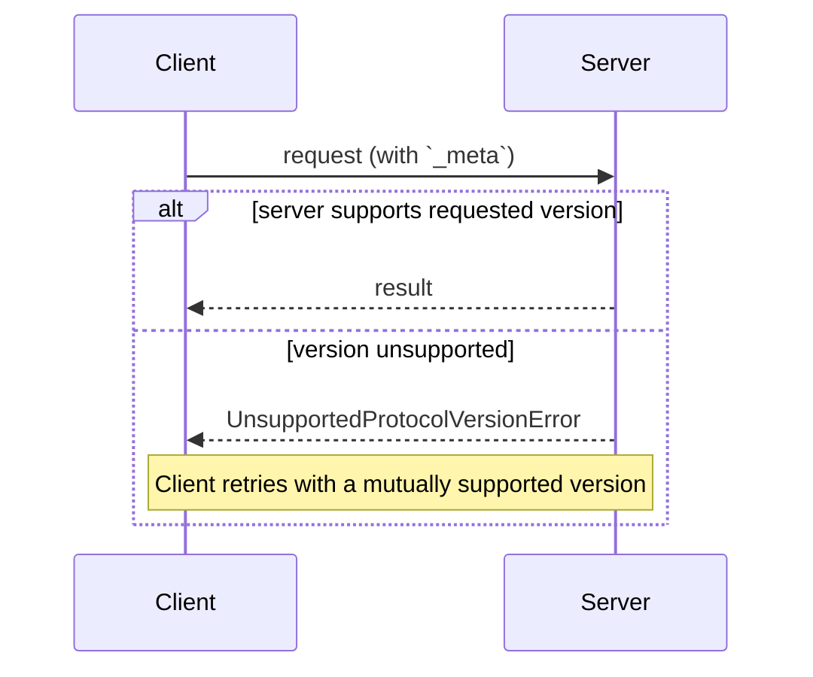

> ## Documentation Index
> Fetch the complete documentation index at: https://modelcontextprotocol.io/llms.txt
> Use this file to discover all available pages before exploring further.

# Lifecycle

<div id="enable-section-numbers" />

The Model Context Protocol (MCP) is a **stateless protocol**: all the
information needed to process a request is contained in the request itself.
A server processes each request independently; no state should be inferred
from previous requests, even those on the same connection or stream.

In particular, an open connection or STDIO process is not a conversation or
session: clients may interleave unrelated requests on the same transport,
and a server **MUST NOT** treat connection or process identity as a proxy
for conversation or session continuity.

Specifically:

* Servers **MUST NOT** rely on prior requests over the same connection to
  establish context (e.g., capabilities, protocol version, client identity).
  Every request supplies this metadata in its
  [`_meta`](/specification/draft/basic/index#meta) field.
* Servers **SHOULD** be prepared to handle requests associated with multiple
  tasks, threads, or conversations. Servers **SHOULD NOT** require that a client
  reuse the same connection or process to perform related operations. Clients
  **SHOULD NOT** use an individual task, thread, or conversation as the default
  lifetime boundary for the stdio process.
* State that needs to span multiple requests (e.g., long-running tasks,
  application-level handles) **MUST** be referenced by an explicit identifier
  the client passes on each request.
* Clients **SHOULD** attempt to restart the stdio process if the server
  terminates unexpectedly.

Long-lived requests like
[`subscriptions/listen`](/specification/draft/basic/utilities/subscriptions)
remain request/response — the response is just an open stream of notifications.
Their state is scoped to the request itself, not to the connection underneath.



<Info>
  For a walkthrough of how the per-request model maps to SDK code, see the
  [Architecture guide](/docs/learn/architecture#example).
</Info>

## Protocol Version Negotiation

Every request declares the protocol version it is using in its
[`_meta`](/specification/draft/basic/index#meta) field. On HTTP, this is
also carried in the
[`MCP-Protocol-Version` header](/specification/draft/basic/transports#protocol-version-header).

If the server does not implement the requested version (whether the version
is unknown to the server, or is a known version the server has chosen not to
support), it **MUST** respond with an
[`UnsupportedProtocolVersionError`](/specification/draft/schema#unsupportedprotocolversionerror)
listing the versions it does support:

```json theme={null}
{
  "jsonrpc": "2.0",
  "id": 1,
  "error": {
    "code": -32004,
    "message": "Unsupported protocol version",
    "data": {
      "supported": ["2026-07-28", "2025-11-25"],
      "requested": "1900-01-01"
    }
  }
}
```

The client **SHOULD** select a mutually supported version from the `supported`
list and retry the request, or surface an error to the user if no compatible
version exists.

Servers **MUST** implement
[`server/discover`](/specification/draft/server/discover). Clients
**MAY** call it before sending any other requests to learn the server's
supported versions up front, but are not required to — a client is free to
invoke any RPC inline and handle `UnsupportedProtocolVersionError` if its
preferred version is not supported.

### Backward Compatibility with Initialization-Based Versions

A server that wishes to support both legacy clients (which expect an
`initialize` handshake) and modern clients (which use per-request metadata)
**MAY** implement both behaviors. A client that needs to interoperate with
both kinds of servers can detect which is present:

* **HTTP.** Try a modern request directly. On `400 Bad Request`, inspect the
  response body before deciding to fall back: a `400` is also used by modern
  servers for `UnsupportedProtocolVersionError`,
  `MissingRequiredClientCapabilityError`, and header-validation failures, so
  the status alone does not indicate a legacy server.
  * If the body contains a recognized modern JSON-RPC error such as
    [`UnsupportedProtocolVersionError`](/specification/draft/schema#unsupportedprotocolversionerror),
    the server speaks a modern version of MCP — retry using one of its
    advertised `supported` versions, or correct the request. Do **not** fall
    back to `initialize`.
  * If the response body is empty or is not a recognized modern JSON-RPC
    error, fall back to `initialize` and continue with the legacy version
    for subsequent requests.
* **STDIO.** Because there is no per-request status code to drive fallback,
  a client that supports both eras **SHOULD** probe with
  [`server/discover`](/specification/draft/server/discover) first,
  setting its preferred modern version in `_meta`. If the server returns
  `Method not found` (`-32601`), fall back to the legacy `initialize`
  handshake. If the server returns `UnsupportedProtocolVersionError`, the
  server speaks a version of MCP without `initialize` — use one of the
  versions in its advertised `supported` list instead of falling back to
  `initialize`.

A client that only supports modern (per-request-metadata) versions does not
need to probe — it simply sends its preferred version and handles
`UnsupportedProtocolVersionError` normally.

## Extension Negotiation

Clients and servers can negotiate support for optional
[extensions](/docs/extensions/overview) beyond the core protocol. Extensions
are advertised in the `extensions` field of capabilities, which is a map of
extension identifiers to per-extension settings objects.

The following is an example of a client that advertises the
[MCP Apps extension](/extensions/apps/overview) identified as `io.modelcontextprotocol/ui`:

```json theme={null}
{
  "capabilities": {
    "roots": {},
    "extensions": {
      "io.modelcontextprotocol/ui": {
        "mimeTypes": ["text/html;profile=mcp-app"]
      }
    }
  }
}
```

An example of [Tasks extension](/extensions/tasks/overview) identified as `io.modelcontextprotocol/tasks`:

```json theme={null}
{
  "capabilities": {
    "tools": {},
    "extensions": {
      "io.modelcontextprotocol/tasks": {}
    }
  }
}
```

Each extension specifies the schema of its settings object; an empty object
indicates support with no additional settings.

If one party supports an extension but the other does not, the supporting
party **MUST** either revert to core protocol behavior or reject the request
with an appropriate error. Extensions **SHOULD** document their expected
fallback behavior.
