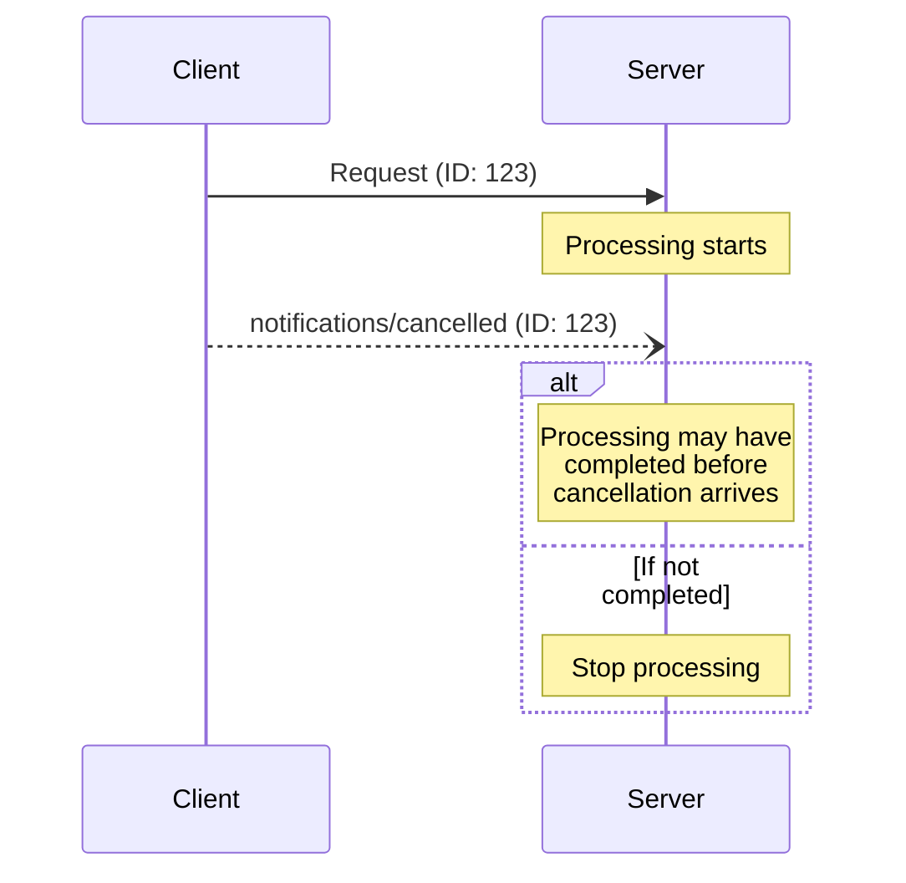

> ## Documentation Index
> Fetch the complete documentation index at: https://modelcontextprotocol.io/llms.txt
> Use this file to discover all available pages before exploring further.

# Cancellation

<div id="enable-section-numbers" />

The Model Context Protocol (MCP) supports optional cancellation of in-progress requests
through notification messages. Either side can send a cancellation notification to
indicate that a previously-issued request should be terminated.

## Cancellation Flow

When a party wants to cancel an in-progress request, it sends a `notifications/cancelled`
notification containing:

* The ID of the request to cancel
* An optional reason string that can be logged or displayed

```json theme={null}
{
  "jsonrpc": "2.0",
  "method": "notifications/cancelled",
  "params": {
    "requestId": "123",
    "reason": "User requested cancellation"
  }
}
```

## Transport-Specific Cancellation

How a client signals cancellation depends on the transport:

* **Streamable HTTP**: Closing the SSE response stream is the cancellation signal.
  The server **MUST** treat a client disconnect as cancellation of that request. No
  `notifications/cancelled` message is required or expected.
* **stdio**: There is no per-request stream to close. The client **MUST** send a
  `notifications/cancelled` notification referencing the request ID.

## Behavior Requirements

1. Cancellation notifications **MUST** only reference requests that:
   * Were previously issued in the same direction
   * Are believed to still be in-progress
2. Receivers of cancellation notifications **SHOULD**:
   * Stop processing the cancelled request
   * Free associated resources
   * Not send a response for the cancelled request
3. Receivers **MAY** ignore cancellation notifications if:
   * The referenced request is unknown
   * Processing has already completed
   * The request cannot be cancelled
4. The sender of the cancellation notification **SHOULD** ignore any response to the
   request that arrives afterward

## Timing Considerations

Due to network latency, cancellation notifications may arrive after request processing
has completed, and potentially after a response has already been sent.

Both parties **MUST** handle these race conditions gracefully:



## Implementation Notes

* Both parties **SHOULD** log cancellation reasons for debugging
* Application UIs **SHOULD** indicate when cancellation is requested

## Error Handling

Invalid cancellation notifications **SHOULD** be ignored:

* Unknown request IDs
* Already completed requests
* Malformed notifications

This maintains the "fire and forget" nature of notifications while allowing for race
conditions in asynchronous communication.
